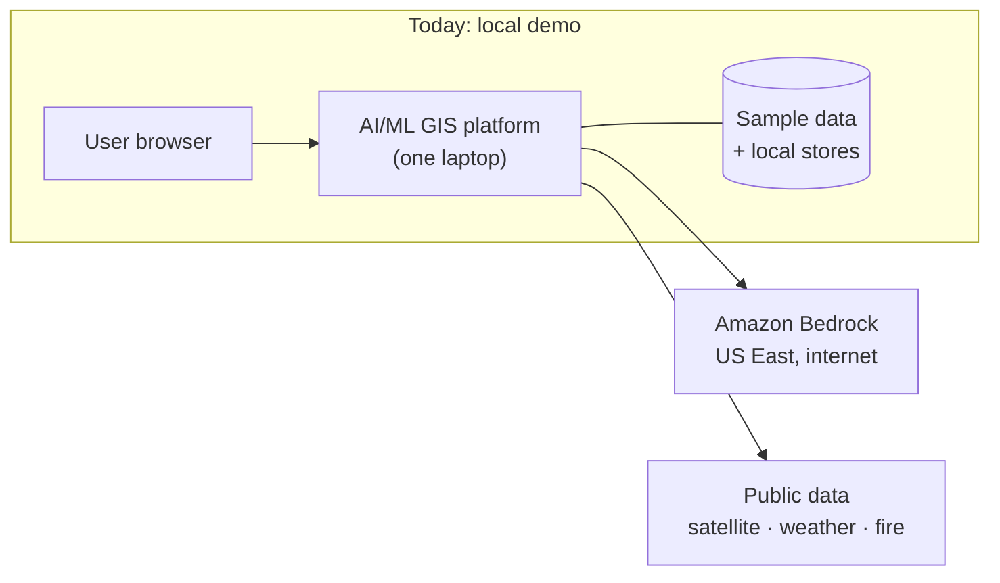
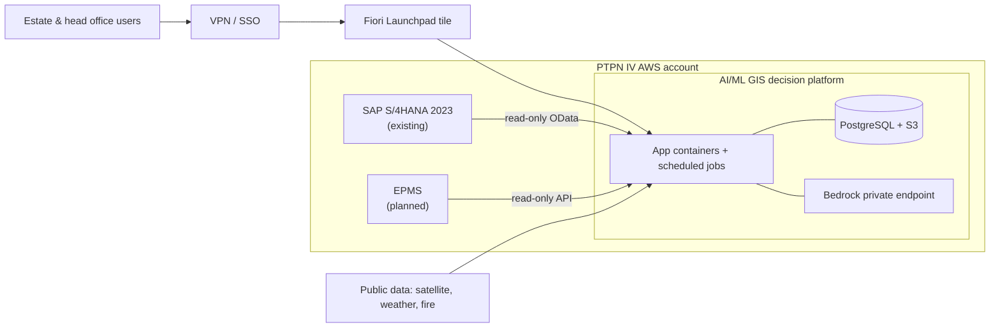

# Context: infrastructure architecture slides for PTPN IV

Use this as context to create **2–3 high-level PowerPoint slides** for a sales
team presenting to a client (PTPN IV PalmCo). The slides show our AI/ML GIS
decision platform's infrastructure **today (a local demo)** and **once it is
deployed inside the client's existing environment**.

Keep it high level: boxes, arrows, a few words each. No ports, file names,
library versions, table names or credentials. Business readers, not engineers.

---

## 1. What the platform is (one line for the slide)

An AI decision layer for plantation operations: a GIS map of every estate
block, forecasting models (FFB production, rain, workforce turnout, work
completion, stock and supplier lead times), and an AI assistant that answers
in the estate's own figures. It reads data; it never writes back to SAP or
EPMS.

Five modules, one application:

| Module | What it does |
|---|---|
| Estate Command (GIS) | Block map, decision panels, tomorrow's work plan, fire / force majeure watch |
| Forecast | Monthly FFB production forecast with uncertainty band and explanation of drivers |
| Stores | Reorder points, safety stock and supplier lead times on SAP MM records |
| Chat / Dashboard / Report | Ask a question in plain language, get an answer, chart or report from estate data |
| AI assistant | Tool-calling copilot; every number it writes is checked against the source data |

---

## 2. Current state: local demo

Everything runs on **one developer laptop** as a single web application. The
only cloud pieces are the AI model service and free public data sources.

**User access**
- Browser on the same laptop (localhost). No login, no SSO, single user.

**Application (on the laptop)**
- One Python web server (FastAPI) serving all five modules and their web pages.
- Map front end (MapLibre) built locally.
- ML models trained and scored on the laptop (forecasts refit when the app starts).

**Data (on the laptop)**
- Estate operational database: PostgreSQL copy of EPMS data for sample estates, read-only.
- Sample/synthetic data files shaped like SAP and EPMS extracts (work orders, attendance, MM stock, purchase orders, weighbridge). These stand in for data the client has not yet provided.
- Local small databases: decision log and assumptions (SQLite), search index for the chat (ChromaDB), model registry/experiment tracking (MLflow), call logs.

**AI models (cloud)**
- Amazon Bedrock (Amazon Nova Pro / Nova Lite), US East region, called over the internet with an API key. Groq kept as a fallback provider.

**Public data (internet, free)**
- Sentinel-2 satellite imagery (canopy health), Copernicus terrain
- Open-Meteo weather history and forecasts, NASA POWER weather
- NASA FIRMS active fire hotspots, NOAA ENSO index

**Prepared but not deployed**
- Infrastructure-as-code (Terraform) for a Bedrock Knowledge Base (document store + vector search) — written, never applied.

**Limitations to state honestly on the slide**
- Single machine, single user, no authentication, no high availability.
- Mostly sample data; not connected to any live SAP or EPMS system.
- AI calls leave for a US region.

---

## 3. Client's current environment (from the joint proposal)

- **SAP S/4HANA 2023 SP1**, on-premise licence, **self-hosted on PTPN IV's own AWS account** (IaaS). Company code PALM.
- Modules in use: FI, CO, PP, PS, MM, SD, FM, QM, PM.
- **SAP Fiori** embedded front-end server exists; daily work still mostly in SAP GUI.
- Partner proposal (in progress, not ours): expose Fiori through **Web Dispatcher + SSL + VPN/SSO**, map users to business roles, My Inbox approvals.
- **No field digitization today** (harvest, transport, upkeep largely paper). Partner proposes **EPMS** mobile/web app (offline-capable, local or cloud), closing daily to SAP via API.
- **No AI**: SAP Joule is not available for on-premise; the partner's alternative requires BTP + Cloud Connector + migration.
- Attachments: partner proposes IBM FileNet with ArchiveLink.
- Client concerns already on record: **data residency and AI governance**.

---

## 4. Target state: deployed in the client's AWS account

Principle: **our platform moves into the client's AWS account next to SAP.**
No BTP subscription, no SAP migration, data stays in their account.

**User access**
- Estate managers, agronomists, procurement, head office.
- Enter through the client's existing **VPN / SSO**, then a **tile in the SAP Fiori Launchpad** (single entry point).
- Map decision points can deep-link to Fiori **My Inbox** for PR/PO approvals.

**Application layer (client AWS, private network)**
- Web application in containers behind an internal load balancer (e.g. ECS Fargate), scaled per estate count.
- Scheduled jobs: nightly data pulls, satellite and weather refresh, model retraining.
- AI assistant calling **Amazon Bedrock through a private endpoint** in the same account (no public internet path, no API keys).

**Data layer (client AWS)**
- Managed PostgreSQL (RDS) for the analytical store, decision log and assumptions.
- S3 for extracts, satellite layers and model artifacts (encrypted).
- Optional: Bedrock Knowledge Base for documents (SOPs, contracts).

**Source systems (read-only)**
- **SAP S/4HANA** via OData services on the existing Fiori Gateway, technical read-only user: MM (stock, movements, purchase orders, reservations), PM (vehicles, work orders), CO (cost), SD (sales commitments), weighbridge/TBS/CPO.
- **EPMS** (once live) via API or read replica: harvest tickets (OPH), grading, attendance, work plans, transport.
- **Public data** via controlled internet egress: satellite, weather, fire hotspots, ENSO.

**Governance and security (put on the slide)**
- Runs in the client's own AWS account; region to be agreed (Jakarta preferred for residency — confirm Bedrock model availability there).
- Read-only to SAP and EPMS; nothing is written back.
- Every AI-generated figure is audited against source data; every number is labelled as measured, derived or predicted.
- Access through the client's SSO and role mapping; audit log of every decision.

---

## 5. What changes, current → target

| Aspect | Current (demo) | Target (client) |
|---|---|---|
| Hosting | One laptop | Client's AWS account, private network |
| Users | 1, no login | Many, via VPN/SSO + Fiori Launchpad tile |
| Data | Sample estates + synthetic extracts | Live SAP (OData) + EPMS + public data |
| App databases | Local SQLite / files | Managed PostgreSQL + S3 |
| AI models | Bedrock US East over internet | Bedrock via private endpoint, agreed region |
| Model training | On laptop at startup | Scheduled jobs in the account |
| Availability | None | Managed, multi-AZ |

---

## 6. Rollout phases (optional small strip on the target slide)

1. **SAP-only modules** — Stores and monthly FFB forecast on live SAP data. Can start in parallel with the Fiori rollout.
2. **GIS map** — needs digitized block boundaries (to confirm whether the client has them).
3. **EPMS-driven modules** — daily work plans, workforce and harvest models, after the EPMS pilot goes live and builds history.

---

## 7. Suggested slides

**Slide 1 – "Today: proven as a working demo"**
Single laptop box containing the app + local data; arrows out to "Amazon Bedrock (AI)" and "Public data (satellite, weather, fire)". Caption: runs on sample data; not yet connected to SAP/EPMS.

**Slide 2 – "Deployed: inside PTPN IV's AWS, next to SAP"**
Left: users → VPN/SSO → Fiori Launchpad tile. Centre: big box "PTPN IV AWS account" containing SAP S/4HANA (existing, grey), EPMS (planned by partner, grey dashed), and our platform (highlighted: app, database/storage, Bedrock private endpoint). Arrows: SAP → platform "read-only OData"; EPMS → platform "read-only API"; public data → platform. Governance badges along the bottom.

**Slide 3 (optional) – "Current vs target" table + phase strip.**

Visual conventions: client's existing systems in grey, partner's planned systems grey dashed, our platform in one highlight colour, read-only arrows one-directional.

### Sketch (for layout reference)

---

## 8. Do not claim

- Do not call it SAP Joule or SAP-supported; it is a custom solution.
- Do not show the demo estate's name or real figures; say "estate".
- Do not promise a specific AWS region or Bedrock model until confirmed.
- Do not imply it is already connected to SAP or EPMS.
